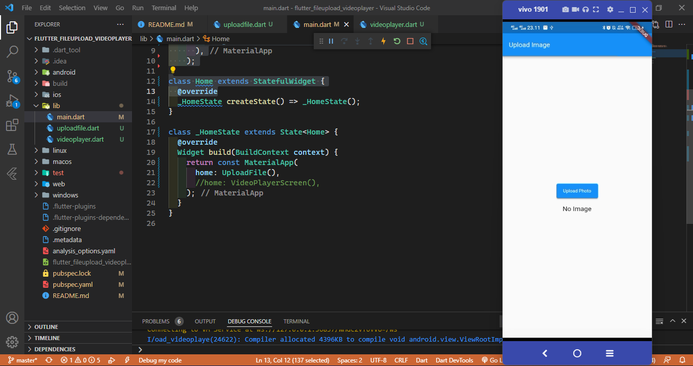
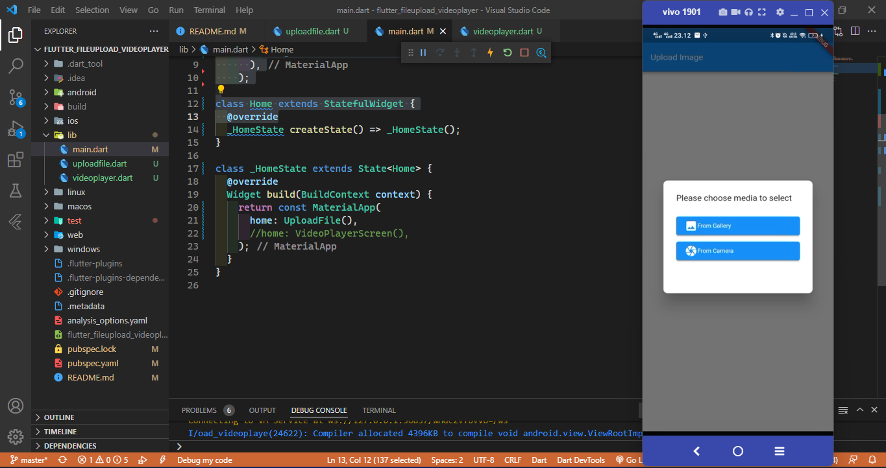
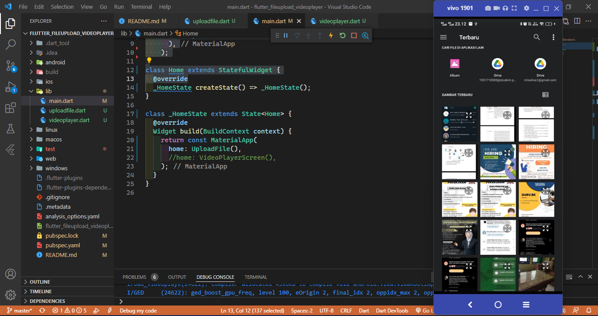
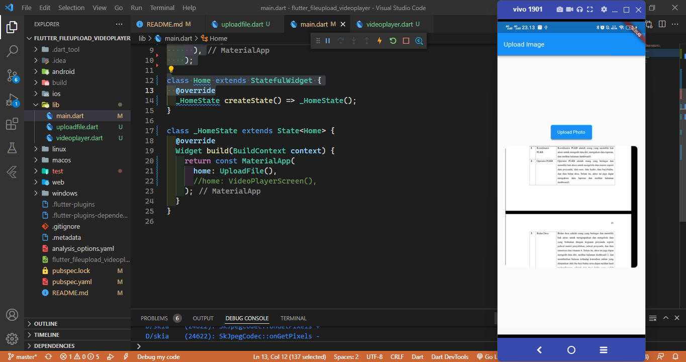
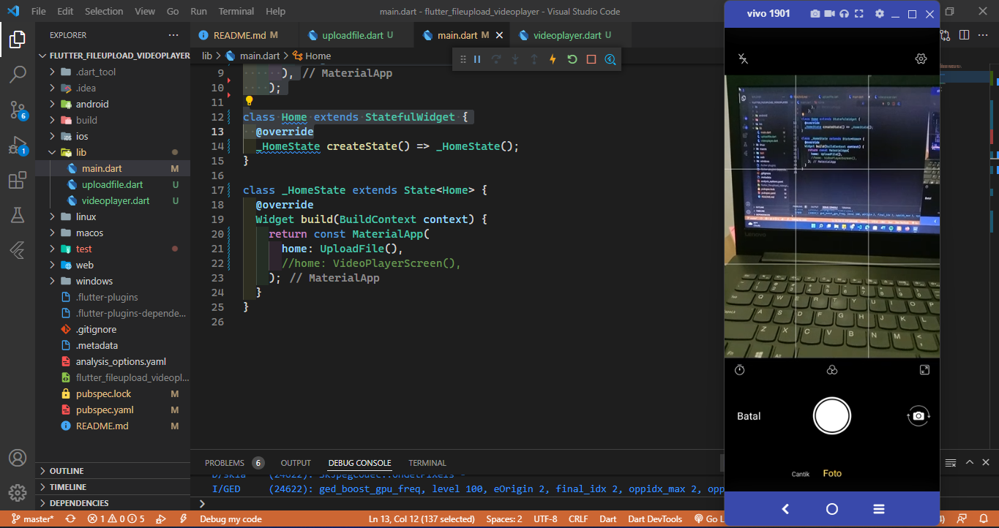
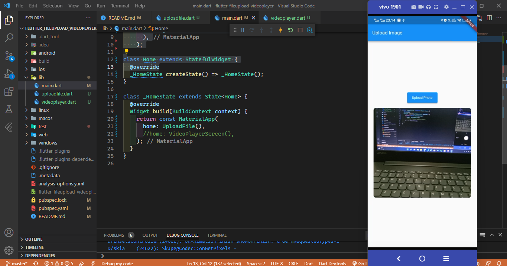

# Local Storage dan Video Player

A new Flutter project.

## Menambahakan Plugin 
Upload File
* image_picker
```
flutter pub add image_picker
```

Video Player Plugin
* video_player
```
flutter pub add video_player
```

## Upload File
- Ketika di running, Terdapat tampilan tombol button untuk upload gambar



#### Upload dari gallery

- Setelah di klik button tersebut maka, Menampilkan pop up yang terdapat 2 opsi button yaitu camera dan gallery


- Ketika di klik pada gallery maka akan ada tampilan upload dari gallery


- Tampilan ketika setelah di klik upload pada halaman home 



#### Upload dari Camera

* Hasil Tampilan upload dari camera


* Tampilan hasil upload



### Video Player
* Ketika pertama kali di running, Menampilkan tampilan video player


* Ketika button pojok bawah di klik play maka Menampilkan tampilan video player yang sudah diputar


